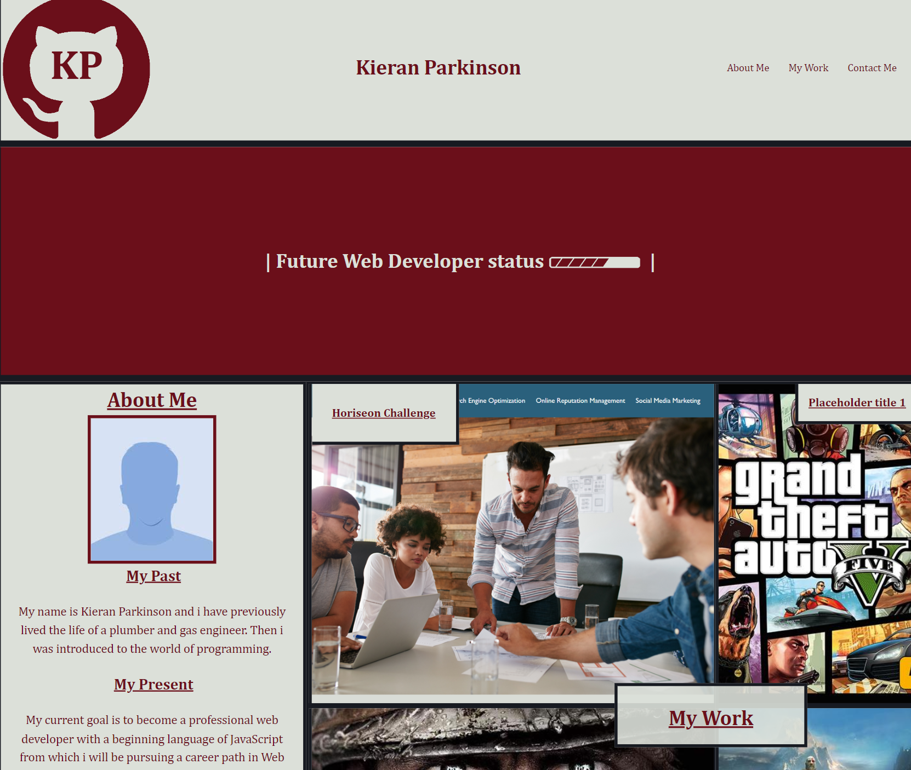

# Bootcamp Challenge 2- Portfolio

## Skills for life Bootcamp Challenge 02 (Portfolio) short description

The objective of this challenge/project is to create a portfolio page from scratch while implementing recently studied CSS techniques such as Flexbox and Grid. Also this is good practice at using media queries to further enhance my understanding of how they work.

This will also be used as my own portfolio page and will evolve over time as my skills as a developer improve.

### User Story

```
AS A Developer in training
I WANT a portfolio page that can be used to display my work on all devices
SO THAT it can serve as a contact reference point and also as a storefront of my skills and work
```

### Acceptance Criteria

My website must work and display correctly on all devices. Also it should show my work (and hold placeholder spots for future works). I have achieved this by completing the following:

- When the page is loaded the page presents my name, a avatar (Photo in future), and links to sections about me, my work, and how to contact you (coming soon)
- When the links in the navigation are clicked then the UI scrolls to the corresponding section
- Application images have attatched links to projects themself (more will be added in future when works completed)
- Media queries have been added to allow the page to work on most devices

### Screenshot of completed site

The following image shows the web application's appearance



### License

Please refer to license in the Repo

### Website Link

https://britishcryptoguy.github.io/Bootcamp-Challenge-2-Portfolio/
